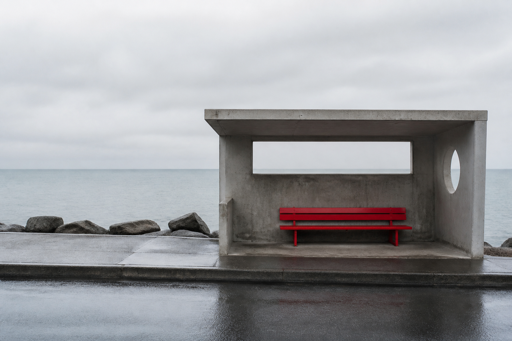
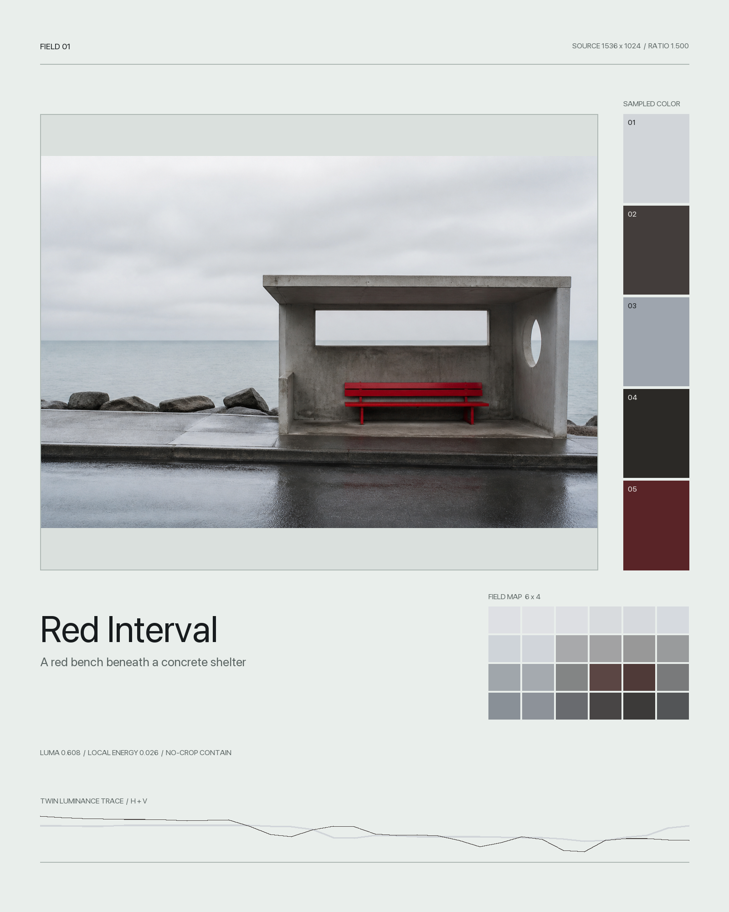

# Photo Evidence Atlas

Photo Evidence Atlas is a Codex Skill that turns one photograph into a restrained editorial evidence plate. The source image stays intact while the surrounding layout records measurable color, luminance, proportion, and spatial rhythm.

The result is generated deterministically with Pillow. It does not depend on an image-generation model, and it never redraws or extends the supplied photograph.

## Example

| Source photograph | Finished evidence plate |
| --- | --- |
|  |  |

The sample photograph was created specifically for this repository. Do not reuse its subject, palette, or title as a template for new work; derive each plate from the user's own photograph.

## What It Produces

- A complete, uncropped photograph window
- Five source-derived color samples
- A 6 x 4 average-color field map
- Horizontal and vertical luminance traces
- Source dimensions, aspect ratio, mean luminance, and local contrast energy
- A short factual title and optional note
- Portrait, square, and landscape layouts in paper or carbon themes
- An optional JSON audit record containing the measurements used by the layout

## Install The Skill

Requirements:

- Python 3.10 or newer
- Pillow 10, 11, or 12

Clone the repository and install Pillow:

```bash
git clone https://github.com/elliotwoo98-dotcom/photo-evidence-atlas.git
cd photo-evidence-atlas
python3 -m pip install -r requirements.txt
```

Copy the Skill folder into the Codex Skills directory:

```bash
mkdir -p ~/.codex/skills
cp -R skill/photo-evidence-atlas ~/.codex/skills/photo-evidence-atlas
```

Start a new Codex task, attach a photograph, and ask:

```text
Use $photo-evidence-atlas to turn this photograph into a restrained visual evidence plate.
```

## Run The Renderer Directly

```bash
python3 skill/photo-evidence-atlas/scripts/build_atlas.py input.jpg output.png \
  --title "Measured Silence" \
  --note "A red interval holds the empty platform" \
  --plate-id "FIELD 01" \
  --format portrait \
  --theme paper \
  --analysis-json output.json
```

Supported output formats are PNG, JPEG, and WebP. The renderer uses a no-crop contain fit and preserves the source file.

## Repository Structure

```text
photo-evidence-atlas/
├── skill/photo-evidence-atlas/
│   ├── SKILL.md
│   ├── agents/openai.yaml
│   ├── references/
│   │   ├── design-system.md
│   │   └── workflow.md
│   └── scripts/build_atlas.py
├── examples/
├── tests/
├── requirements.txt
└── LICENSE
```

## Test

```bash
python3 -m unittest discover -s tests -v
```

## Independent Work

This is an original, independently implemented project. It does not reuse another repository's prompts, prose, example images, branding, visual assets, code, or license. Its visual system is based on deterministic image measurements and a purpose-built evidence-page layout.

## License

Released under the [MIT License](LICENSE).
